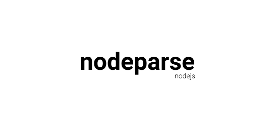

# nodeparse 



[](https://www.npmjs.org/package/nodeparse)
[](https://packagephobia.now.sh/result?p=nodeparse)
[](http://npm-stat.com/charts.html?package=nodeparse)

A lightweight, vanilla replacement for Express framework when parsing the HTTP body's data or parsing the URL parameters and queries with NodeJS.

## Installing

Using npm:

```bash
$ npm install nodeparse
```

## Using

You first need to import the module.

```js
const NodeParse = require("nodeparse");
```

Create a basic NodeJS http server, create nodeparse instance and use `init()` method.
```js
const http = require("http");
const NodeParse = require("nodeparse");
const port = process.env.PORT || 8080;

const server = http.createServer(function (req, res) {
	const nodeparse = new NodeParse(req, res);
	nodeparse.init();	
});

server.listen(port, function (error) {
	if (error) throw error;
	console.log("Server is running on port ", port);
});
```

## Parsing url params

Using `nodeparse.params` to get an array of params.

```js
const server = http.createServer(function (req, res) {
	const nodeparse = new NodeParse(req, res);
	nodeparse.init();

	if (req.method === "GET") {
		console.log(nodeparse.params);
		/*
			https://localhost:3000/api/products
			
			output: ["api", "products"]
		*/
	}
});
```

## Parsing url queries

Using `nodeparse.queries` to get an object of queries.

```js
const server = http.createServer(function (req, res) {
	const nodeparse = new NodeParse(req, res);
	nodeparse.init();
	
	if (req.method === "GET") {
		console.log(nodeparse.queries);
		/*
			https://localhost:8080/api/products?name=banana&size=xl

			output: {"name": "banana", "size": "xl"}
		*/
	}
});
```

## Parsing the http data

Because `nodeparse.data` is a promise return from `req.on()` so you need to `await` with `nodeparse.init()` inside an `async` function.

```js
const server = http.createServer(async function (req, res) {
	const nodeparse = new NodeParse(req, res);
	await nodeparse.init();

	if (req.method === "POST") {
		console.log(nodeparse.data);
	}
});
```

## Credits

nodeparse is inspired by [express](https://github.com/expressjs/express) when developers have to deal with params, queries and data with NodeJS. 

## License

[MIT](LICENSE)
